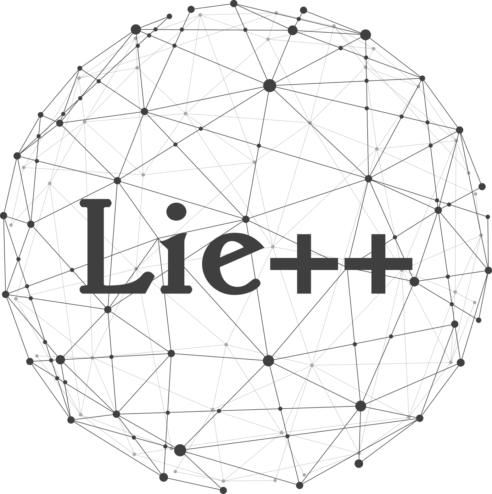

# Lie++

[](./LICENSE)




Maintainer: [Alessandro Fornasier](mailto:alessandro.fornasier@aau.at)

- [Description](#description)
- [Installation](#installation)
- [Usage](#usage)
  * [Base groups usage](#base-groups-usage)
  * [Composition of groups](#composition-of-groups)
- [Credit](#credit)
  * [License](#license)
  * [Usage for academic purposes](#usage-for-academic-purposes)

## Description

Lie++ is a header-only C++ library based on Eigen for Lie groups. It provides a set of classes and functions for working with common Lie groups encountered in robotics application.

| Base groups  | Applications                      |
| ------------ | ----------------------------------|
| SO(3)        | Rotation                          |
| SE(3)        | Pose                              |
| SE2(3)       | Extended pose                     |
| SEn(3)       | SLAM                              |
| Gal(3)       | Discrete-time Inertial navigation |
| SOT(3)       | Rotation and scaling              |
| TG           | Inertial navigation with IMU bias |
| SDB          | Inertial navigation with IMU bias |

## Installation

This is a header-only C++ library meant to be used within other projects. Either copy the content of `include` folder within the external project's `include` folder or use cmake's `FetchContent_Declare` as follows
```
FetchContent_Declare(
    LiePlusPlus
    GIT_REPOSITORY  
    GIT_TAG         main
    GIT_SHALLOW     TRUE
    GIT_PROGRESS    TRUE
)
list(APPEND external LiePlusPlus) 
list(APPEND include_dirs ${LIEPLUSPLUS_INCLUDE_DIR})
list(APPEND libs LiePlusPlus Eigen3::Eigen)
```
## Usage

Two mini examples on how to use the base groups of the library and how to compose them to create new groups. For usage of Lie++ in the context of filter design have a look at [MSCEqF](https://github.com/aau-cns/MSCEqF)

### Base groups usage

```cpp
#include <groups/SEn.hpp>

int main(int argc, char **argv)
{
  using SO3d = group::SO3<double>;
  using SE23d = group::SEn3<double, 2>;
  using Vector3d = Eigen::Matrix<double, 3, 1>;
  using Vector9d = Eigen::Matrix<double, 9, 1>;
  using Matrix9d = Eigen::Matrix<double, 9, 9>;
  
  # Define random extended pose X via exponential map
  Vector9d x = Vector9d::Random();
  SE23d X = SE23d::exp(x);
  
  # Define Extended pose Y with identity rotation, and given velocity and position
  Vector3d p = Vector3d(1, 2, 3);
  Vector3d v = Vector3d(0.1, 0.1, 0.3);
  SO3d R = SO3d();
  SE23d Y = SE23d(R, {v, p});
  
  # Get extended pose composition Z = XY
  SE23d Z = X*Y;
  
  # print Z as matrix
  std::cout << Z.asMatrix() << std::endl;
  
  # print Rotational component of Z as quaternion, position and velocity
  std::cout << Z.q() << '\n' << Z.p() << '\n'<< Z.v() << '\n' std::endl;
  
  # get Adjoint matrix of SE23
  Matrix9d AdZ = Z.Adjoint();
}
```

### Composition of groups

```cpp
#include <groups/SEn.hpp>

/**
 * @brief Composition of SO(3) and SE(3) via direct product
 */
template <typename FPType>
class ComposedGroup
{
  public:
    using SO3 = group::SO3<FPType>;
    using SE3 = group::SEn3<FPType, 1>;
    using Vector3 = Eigen::Matrix<FPType, 3, 1>;
    using Vector6 = Eigen::Matrix<FPType, 6, 1>;
    using Vector9 = Eigen::Matrix<FPType, 9, 1>;
  
    ComposedGroup() : C_(), P_() {};
    
    ComposedGroup(const SO3& C, const SE3& P) : C_(C), P_(P) {};
    
    // other constructors ...
    
    [[nodiscard]] static const ComposedGroup exp(const Vector9& u)
    {
      return ComposedGroup(SO3::exp(u.template block<3, 1>(0, 0)), SE3::exp(u.template block<6, 1>(3, 0)));
    }

    [[nodiscard]] static const Vector9 log(const ComposedGroup& X)
    {
      Vector6 u = Vector9::Zero();
      u.template block<3, 1>(0, 0) = SO3::log(X.C_);
      u.template block<6, 1>(3, 0) = SE3::log(X.P_);
      return u;
    }
    
    [[nodiscard]] const ComposedGroup operator*(const ComposedGroup& other) const
    {
      return ComposedGroup(C_ * other.C_, P_ * other.P_);
    }
    
    // other methods ...
    
  private:
    SO3 C_;
    SE3 P_;
    
}
```

## Credit
This code was written within the [Control of Networked System (CNS)](https://www.aau.at/en/smart-systems-technologies/control-of-networked-systems/), University of Klagenfurt.

### License
This software is made available to the public to use (_source-available_), licensed under the terms of the BSD-2-Clause-License with no commercial use allowed, the full terms of which are made available in the `LICENSE` file. No license in patents is granted.

### Usage for academic purposes
If you use this software in an academic research setting, please cite the corresponding paper.

```latex
@article{fornasier2023equivariant,
  title={Equivariant Symmetries for Inertial Navigation Systems},
  author={Fornasier, Alessandro and Ge, Yixiao and van Goor, Pieter and Mahony, Robert and Weiss, Stephan},
  journal={arXiv preprint arXiv:2309.03765},
  year={2023}
}

@article{fornasier2023msceqf,
  title={MSCEqF: A Multi State Constraint Equivariant Filter for Vision-aided Inertial Navigation},
  author={Fornasier, Alessandro and van Goor, Pieter and Allak, Eren and Mahony, Robert and Weiss, Stephan},
  journal={arXiv preprint arXiv:2311.11649},
  year={2023}
}
```

